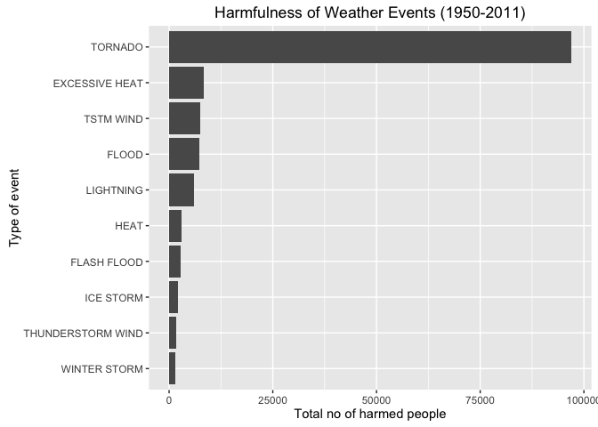
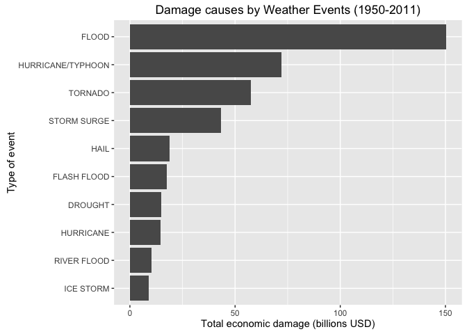

# RPR-PA2. Analysis of the effects of severe weather events on population and economy (1950-2011)
Gerrit Versteeg  
October 27th, 2016  


## Synposis
In this report we aim to research what type of severe weather events (1950-2011) have the most impact on the population and on the economy based on a dataset (StormData.csv) on the course website. The impact on the polulation refers to the 'harm' done in the form of fatalities and injuries, therefore these values have been added to calculate the total harm caused. The economic consequences refer to the 'damage' on property as well as crops, therefore these two values have been summed to calculate the total damage caused.

The analysis leads to the following conclusions. Most harm to people was caused by 'TORNADO' (almost 100,000 people harmed), while on average 'Heat Wave' events rank highest causing 70 people harmed per event. Most damage to properties and crops in total is caused by 'FLOOD' (150 billion USD), while the average damage per event was highest for 'TORNADOES, TSTM WIND, HAIL' (1.6 Billion USD/per event), followed by 'HEAVY RAIN/SEVERE WEATHER' (1.25 Billion USD/event).

The analysis showed that the event types used in the dataset are not leveled correctly, because types (e.g. 'HURRICANE') are mixed with 'occurrences (e.g. 'HURRICANE OPAL' and 'HURRICANE OPAL/HIGH WINDS') and also typecase variations lead to for example 'Heat Wave' being different from 'HEAT WAVE'. Therefore, conclusions drawn are probably not representing actual types of weather events (perhaps the dataset as cleansed by NOAA in 2012, may yield more realistic results).


## Data Processing
### Loading the data
The data for this assignment come in the form of a comma-separated-value file compressed via the bzip2 algorithm to reduce its size. The file is to be downloaded from the course web site: [Storm Data 47Mb](https://d396qusza40orc.cloudfront.net/repdata%2Fdata%2FStormData.csv.bz2).

Because the dataset (in BZ2-format) is to be retreived from a website, we have to download the file first. We store the file into the /data-directory.
BZ2-files can be read natively by read.csv, so we do not need to unzip. The resulting storm data file is transformed into a tibble (dplyr dataset) 'DF_raw' using dplyr for faster data-manipulation.


```r
library("plyr", warn.conflicts=FALSE)           ## load plyr silently
library("dplyr", warn.conflicts=FALSE)          ## load dplyr silently
library("ggplot2", warn.conflicts=FALSE)        ## load ggplot2 silently
myURL <- 
    "https://d396qusza40orc.cloudfront.net/repdata%2Fdata%2FStormData.csv.bz2"
myURL <- sub("^https", "http", myURL)           ## stripping s from https (Mac's) 
if (!file.exists("data")) {                     ## checking the /data
        dir.create("data")                      ## directory as landing place
}
##download.file(myURL,                            ## download from given URL
##      destfile = "./data/temp.zip",             ## into temp.zip
##      mode="wb")                                ## using binary mode
dateDownloaded <- date()                        ## register date of download
DF_raw <- tbl_df(read.csv("./data/temp.zip"))   ## load into dataset/tibble
DF_raw                                          ## and take a peek
```

```
## # A tibble: 902,297 x 37
##    STATE__           BGN_DATE BGN_TIME TIME_ZONE COUNTY COUNTYNAME  STATE
##      <dbl>             <fctr>   <fctr>    <fctr>  <dbl>     <fctr> <fctr>
## 1        1  4/18/1950 0:00:00     0130       CST     97     MOBILE     AL
## 2        1  4/18/1950 0:00:00     0145       CST      3    BALDWIN     AL
## 3        1  2/20/1951 0:00:00     1600       CST     57    FAYETTE     AL
## 4        1   6/8/1951 0:00:00     0900       CST     89    MADISON     AL
## 5        1 11/15/1951 0:00:00     1500       CST     43    CULLMAN     AL
## 6        1 11/15/1951 0:00:00     2000       CST     77 LAUDERDALE     AL
## 7        1 11/16/1951 0:00:00     0100       CST      9     BLOUNT     AL
## 8        1  1/22/1952 0:00:00     0900       CST    123 TALLAPOOSA     AL
## 9        1  2/13/1952 0:00:00     2000       CST    125 TUSCALOOSA     AL
## 10       1  2/13/1952 0:00:00     2000       CST     57    FAYETTE     AL
## # ... with 902,287 more rows, and 30 more variables: EVTYPE <fctr>,
## #   BGN_RANGE <dbl>, BGN_AZI <fctr>, BGN_LOCATI <fctr>, END_DATE <fctr>,
## #   END_TIME <fctr>, COUNTY_END <dbl>, COUNTYENDN <lgl>, END_RANGE <dbl>,
## #   END_AZI <fctr>, END_LOCATI <fctr>, LENGTH <dbl>, WIDTH <dbl>, F <int>,
## #   MAG <dbl>, FATALITIES <dbl>, INJURIES <dbl>, PROPDMG <dbl>,
## #   PROPDMGEXP <fctr>, CROPDMG <dbl>, CROPDMGEXP <fctr>, WFO <fctr>,
## #   STATEOFFIC <fctr>, ZONENAMES <fctr>, LATITUDE <dbl>, LONGITUDE <dbl>,
## #   LATITUDE_E <dbl>, LONGITUDE_ <dbl>, REMARKS <fctr>, REFNUM <dbl>
```

### Preprocessing the data
The instructions also pointed to the documentation of the dataset that we used to interpret the definition/construction of the variables in the dataset:

* From the National Weather Service: [Storm Data Documentation](https://d396qusza40orc.cloudfront.net/repdata%2Fpeer2_doc%2Fpd01016005curr.pdf)
* From the National Climatic Data Center: [Storm Events FAQ](https://d396qusza40orc.cloudfront.net/repdata%2Fpeer2_doc%2FNCDC%20Storm%20Events-FAQ%20Page.pdf)

The events in the dataset start in the year 1950 and end in November 2011. In the earlier years of the dataset there are generally fewer events recorded, most likely due to a lack of good records. More recent years should be considered more complete. In March 2012 a large overhaul of the dataset was performed by [NOAA](http://www.noaa.gov/). This major overhaul also cleansed the historic data i.e. data prior to 2012. The dataset we are working with in this analysis, contains the original data, meaning data that has NOT been cleansed in the 2012 effort. 

Next step is to pre-process the data for analysis.  

**EVTYPE**
EVTYPE, being the type of event that took place, is our main variable for analysis. Because the assignment clearly states *"as indicated in the EVTYPE variable"* this variable will not be altered in any way and will be used **as is**.

**HARMFULNESS**
Examining the provided documentation, FATALITIES (direct and indirect) as well as INJURIES (direct or indirect) can be interpreted as being 'harmful' for the health of the population. No preparation is needed, they are already in numeric format.

**Economic consequenties**
Economic consequenties refer to the damage listed in the 'DMG'-variables, where PROPDMG and CROPDMG contain the damage to properties and crops.
Note that factor-variables PROPDMGEXP and CROPDMGEXP appear to contain references to multiplications of resp. PROPDMG and CROPDMG. Therefore, these variables need to be taken into account to determine the amount of damage. Let's first take a look at these 'EXP'-variables:


```r
levels(DF_raw$PROPDMGEXP)
```

```
##  [1] ""  "-" "?" "+" "0" "1" "2" "3" "4" "5" "6" "7" "8" "B" "h" "H" "K"
## [18] "m" "M"
```

```r
levels(DF_raw$CROPDMGEXP)
```

```
## [1] ""  "?" "0" "2" "B" "k" "K" "m" "M"
```

The various values of the 'EXP'-variables don't match up completely and they are also not very self-explanatory. The documentation does not contain any reference to (the explanation) of the 'EXP' variables. 

NOAA actually cleaned up their data (including the EXP-variables) in 2012. Comparing the cleansed historic data in the new dataset at NOAA with the data in our (old) dataset leads to the following list:

| Code | Code | Multiplier |
| --- | --- | --- |
| H | h | 10<sup>2</sup> |
| K | k | 10<sup>3</sup> |
| M | m | 10<sup>6</sup> |
| B | b | 10<sup>9</sup> |
| + |   | 1 |
| - |  | 0 |
| ? | space | 0 |
| 0-8 |  | 10 |

*Reference: [Soesilo Wijono](https://plus.google.com/116355576801964691507?rel=author).*

Because the research is based on the cleansing by NOAA it appears best to use this interpretation, instead of making our own ill-informed 'guesses'.  

Data preparation will therefore consist of deriving the correct multipliers from the EXP-variables, followed by adding two columns to enable easy use of the DMG-variables: 

* PROPDMGTOT, containing the actual damage to property (PROPDMG * the multiplier of PROPDMGEXP)

* CROPDMGTOT, containing the actual damage to crops (CROPDMG * the multiplier of CROPDMGEXP). 

The remaining 30 of the 37 original variables is of no use for our analysis and will be dropped.


```r
code <- union(levels(DF_raw$PROPDMGEXP),           ## make vector of all unique
              levels(DF_raw$CROPDMGEXP))           ## values in de EXP-var's

mult <-                                             ## accompanying multipliers
        as.character(c(0, 0, 0, 1,                  ## for: space - ? +
          10, 10, 10, 10, 10, 10, 10, 10, 10,       ## for: numerics 0-8
          1000000000, 100, 100,                     ## for: B h H
          1000, 1000000, 1000000, 1000))            ## for: K m M k

propmult <- as.integer(as.character(                ## create propmult vector
                  mapvalues(DF_raw$PROPDMGEXP,      ## by mapping PROPDMGEXP
                  code, mult,                       ## from code to multiplier
                  warn_missing = FALSE)))           ## silently

cropmult <- as.integer(as.character(                ## create cropmult vector
                  mapvalues(DF_raw$CROPDMGEXP,      ## by mapping CROPDMGEXP
                  code, mult,                       ## from code to multiplier
                  warn_missing = FALSE)))           ## silently

DF_prep <-                                          ## Create DF_prep
        DF_raw %>%                                  ## use DF-raw to
        select(EVTYPE, FATALITIES, INJURIES,        ## select relevant columns
               PROPDMG, PROPDMGEXP, 
               CROPDMG, CROPDMGEXP) %>%
        mutate(PROPDMGTOT = PROPDMG * propmult) %>% ## add actual prop damage
        mutate(CROPDMGTOT = CROPDMG * cropmult) %>% ## add actual crop damage
        print()                                     ## and let's have a look
```

```
## # A tibble: 902,297 x 9
##     EVTYPE FATALITIES INJURIES PROPDMG PROPDMGEXP CROPDMG CROPDMGEXP
##     <fctr>      <dbl>    <dbl>   <dbl>     <fctr>   <dbl>     <fctr>
## 1  TORNADO          0       15    25.0          K       0           
## 2  TORNADO          0        0     2.5          K       0           
## 3  TORNADO          0        2    25.0          K       0           
## 4  TORNADO          0        2     2.5          K       0           
## 5  TORNADO          0        2     2.5          K       0           
## 6  TORNADO          0        6     2.5          K       0           
## 7  TORNADO          0        1     2.5          K       0           
## 8  TORNADO          0        0     2.5          K       0           
## 9  TORNADO          1       14    25.0          K       0           
## 10 TORNADO          0        0    25.0          K       0           
## # ... with 902,287 more rows, and 2 more variables: PROPDMGTOT <dbl>,
## #   CROPDMGTOT <dbl>
```

To check for missing values in the relevant columns we sum the NA's of the whole dataset:


```r
sum(is.na(DF_prep))                 ## to check for missing values in dataset
```

```
## [1] 0
```

No missing values are present, so we can start doing the analysis.


## Results
### Harmful events
In this section we analyze which types of events (as indicated in the EVTYPE variable) are most harmful with respect to population, across the United States.
Because no definiton of 'harmful' is prescribed and no reference is made to separate deaths from injuries, we'll use a simple addition of the values in the variables FATALITIES and INJURIES to measure the level of harmfulness and put their sum into a new variable named 'HARM'. 

**Unbalanced registration**
Because we are looking at a dataset with a very limited number of event types (mostly tornadoes) in the early years of data-gathering, it may lead to incorrect conclusions if we were to simply accumulate all 'harm' for each event type. 
To overcome the unbalanced nature of the dataset, we not only calculate the total number of people harmed, but also calculate the average 'harm' of each event type, so that the unbalanced number of occurrences of event types over the years of registration is minimized.

We use variable HARM as the sum of fatalities and injuries, the variable AVG for the mean per type of event to determine which events have the highest harmfulness on average and the variable TOT for the total number of people harmed for each event type. Event types with an average of total harmfulness of 0 will be dropped.


```r
DF_harmavg <-                                     ## create DF_harmavg
        DF_prep %>%                               ## use DF-prep to
        mutate(HARM = FATALITIES + INJURIES) %>%  ## add the column HARM
        group_by(EVTYPE) %>%                      ## group by EVTYPE
        summarize(AVG = mean(HARM)) %>%           ## calc. avg harmfulness
        arrange(desc(AVG)) %>%                    ## sort descending by AVG
        filter(AVG > 0)

DF_harmsum <-                                     ## create DF_harmsum
        DF_prep %>%                               ## use DF-prep to
        mutate(HARM = FATALITIES + INJURIES) %>%  ## add the column HARM
        group_by(EVTYPE) %>%                      ## group by EVTYPE
        summarize(TOT = sum(HARM)) %>%            ## calc. total harmfulness
        arrange(desc(TOT)) %>%                    ## sort descending by total
        filter(TOT > 0)
```

Now we will create a figure that shows two tranposed barplots to visualize the results for the first 10 types of events that cause the highest harm to the population; one for the average harm and another for the total harm. 


```r
h <- ggplot(DF_harmsum[1:10,], 
        aes(x=reorder(EVTYPE, TOT), y = TOT))            ## setup graphic object

h+geom_bar(stat = "identity") +                          ## plot the bars
        coord_flip() +                                   ## flip plot
        xlab("Type of event") +                          ## lable X-axis
        ylab("Total no of harmed people") +              ## lable Y-axis
        ggtitle("Harmfulness of Weather Events (1950-2011)") ## title plot
```

<!-- -->

Looking at the *total* harm caused by severe weather events (bottom barplot), we see 'TORNADO' having the highest harmfulness by far, with almost 100.000 people harmed (fatalities + injuries). 

> **Average harmfulness per type of event**


| EVTYPE | People harmed on average |
|----|:----|
| Heat Wave | 70 |
| TROPICAL STORM GORDON | 51 |
| WILD FIRES | 38 |
| THUNDERSTORMW | 27 |
| TORNADOES, TSTM WIND, HAIL | 25 |
| HIGH WIND AND SEAS | 23 |
| HEAT WAVE DROUGHT | 19 |
| SNOW/HIGH WINDS | 18 |
| WINTER STORM HIGH WINDS | 16 |
| HURRICANE/TYPHOON | 15 |

Harmfulness per event type *on average* however, shows 'Heat Waves' (70 people harmed) as causing the most fatalities and injuries, followed by 'TROPICAL STORM GORDON'(51 people harmed). 

The plot shows us that there is a problem with the event types in the dataset, for instance: tropical storm gordon is a specific storm and not the event type 'tropical storm'. Types and occurrences seem to have been mixed up. Another issue is the 'Heat Wave' versus "HEAT WAVE', where event types have been seperated due to their spelling and typecase.
Note that we will **not** clean this up, because the assignment clearly states that we need to use the EVTYPE variable as a given.


### Economic Consequences
In this section we analyze which types of events (as indicated in the EVTYPE variable) have the most severe economic consequences, across the United States.
Events can have economic consequences (damage) to property as well as crops. Because no definiton of 'economic consequence' is prescribed and no reference is made to separate damage to crops from damage to property, we will simply consider the sum of property damage and crop damage to be the total 'economic consequence' of the event type. The total damage will be put in a new variable 'DAMAGE'.

We will continu to use the average of the damage next to the total damage for each event type, as explained under 'unbalanced registration' in the section Data Analysis, Harmful Events. 
Using DAMAGE we calculate the total damage per event type (TOT) and the mean per type of event (AVG), to determine which events have the highest damage on average. Event types with an average or total damage of 0 will be dropped.


```r
DF_damavg <-                                          ## create DF_damavg
        DF_prep %>%                                   ## use DF-prep to
        mutate(DAMAGE = PROPDMGTOT + CROPDMGTOT) %>%  ## add the column DAMAGE
        group_by(EVTYPE) %>%                          ## group by EVTYPE
        summarize(AVG = mean(DAMAGE)) %>%             ## calc. avg damage
        mutate(AVG = AVG / 1000000000) %>%            ## in billions of dollars
        arrange(desc(AVG)) %>%                        ## sort descending by AVG
        filter(AVG > 0)

DF_damsum <-                                          ## create DF_damsum
        DF_prep %>%                                   ## use DF-prep to
        mutate(DAMAGE = PROPDMGTOT + CROPDMGTOT) %>%  ## add the column DAMAGE
        group_by(EVTYPE) %>%                          ## group by EVTYPE
        summarize(TOT = sum(DAMAGE)) %>%              ## calc. total damage
        mutate(TOT = TOT / 1000000000) %>%            ## in billions of dollars
        arrange(desc(TOT)) %>%                        ## sort descending by total
        filter(TOT > 0)
```

Now we will generate a figure with two tranposed barplots to visualize the economic damage caused by the first highest-ranking 10 events (crops + properties). The top barplot shows the avarage damage per event type, while the bottom barplot depicts the average damage for each type of event. 


```r
d <- ggplot(DF_damsum[1:10,], 
        aes(x=reorder(EVTYPE, TOT), y = TOT))            ## setup graphic object
d+geom_bar(stat = "identity") +                          ## plot the bars
        coord_flip() +                                   ## flip plot
        xlab("Type of event") +                          ## lable X-axis
        ylab("Total economic damage (billions USD)") +   ## lable Y-axis
        ggtitle("Damage causes by Weather Events (1950-2011)") ## title plot
```

<!-- -->

Looking at the total damage on crops and property caused by severe weather events, 'FLOOD' ranks highest with 150 billion USD, followed by 'HURRICANE/TYPHOON' (72 billion USD) and 'TORNADO' (53 billion USD).

However, looking at the table below, event type 'TORNADOES, TSTM WIND, HAIL' causes the most damage on average: 1.6 billion USD. Followed by 'HEAVY RAIN/SEVERE WEATHER' with average damages of 1.25 billion USD.


> **Average damage per type of event**

| EVTYPE | Damage on average (billions of dollars) |
|----|:----|
| TORNADOES, TSTM WIND, HAIL | 1.602 |
| HEAVY RAIN/SEVERE WEATHER | 1.25 |
| HURRICANE/TYPHOON | 0.817 |
| HURRICANE OPAL | 0.355 |
| STORM SURGE | 0.166 |
| WILD FIRES | 0.156 |
| EXCESSIVE WETNESS | 0.142 |
| HURRICANE OPAL/HIGH WINDS | 0.11 |
| SEVERE THUNDERSTORM | 0.093 |
| HURRICANE | 0.084 |


Again we see the awkward use of types versus occurrences. Hurricanes are listed as type 'HURRICANE', as well as occurrence 'HURRICANE OPAL' and even mixed types like 'HURRICANE OPAL/HIGH WINDS'. Nevertheless, as stated before, we kept on using the EVTYPE **as such** and did not transform EVTYPES into nicely belanced actual weather types.


## Warning regarding the value of the results
The variable EVTYPE in the given dataset (1995-2011) is not defined and categorized correctly. Types and occurrences are mixed in together, while typecasing leads to unnecessary variation in event types. In essence this means that the conclusions only refer to 'EVTYPE', i.e. NOT to actual types of weather events.
